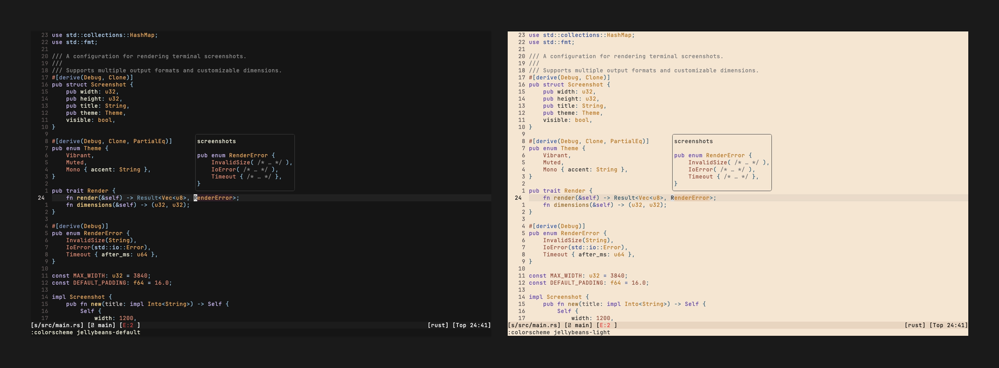
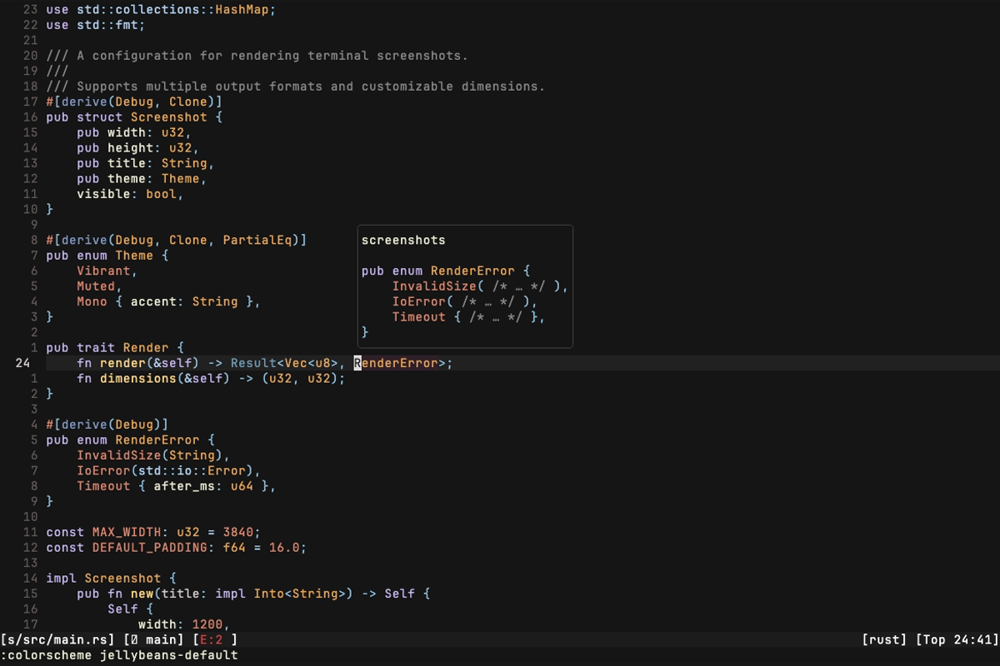
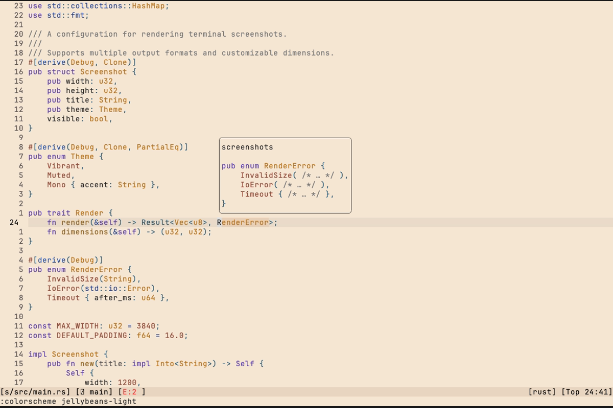
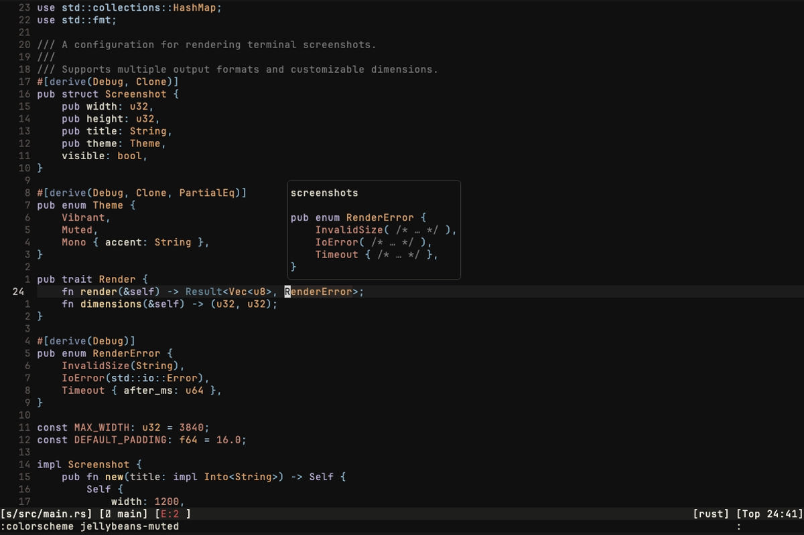
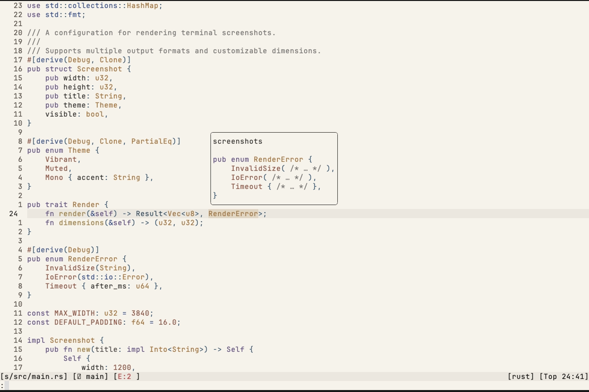
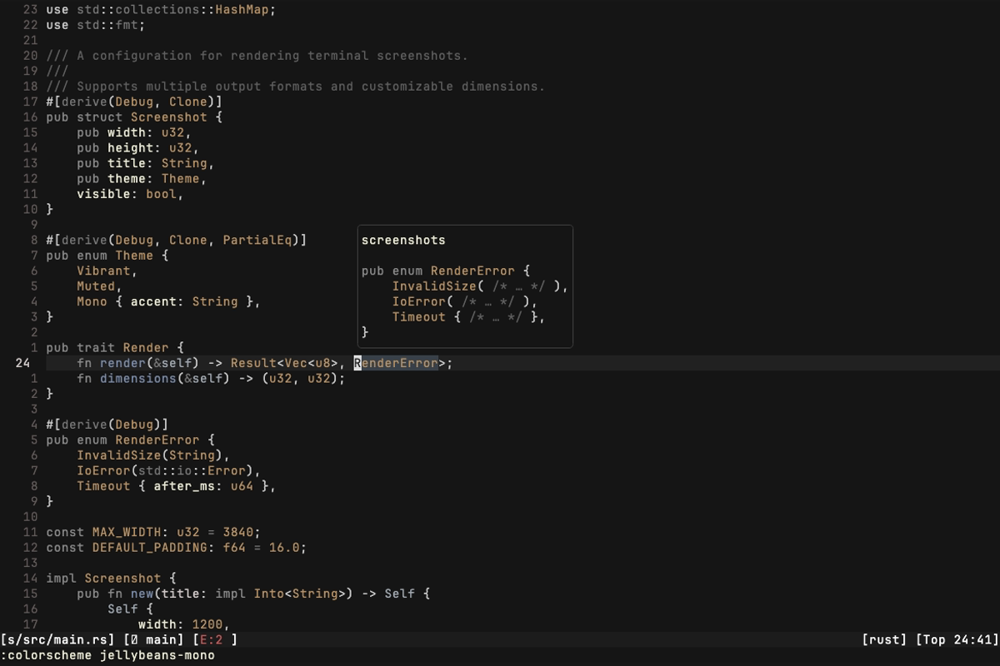
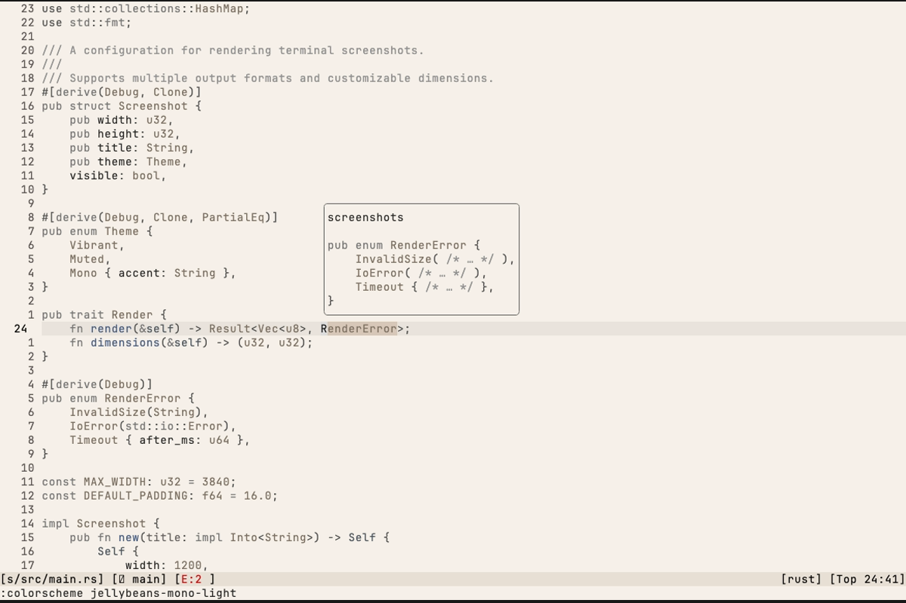
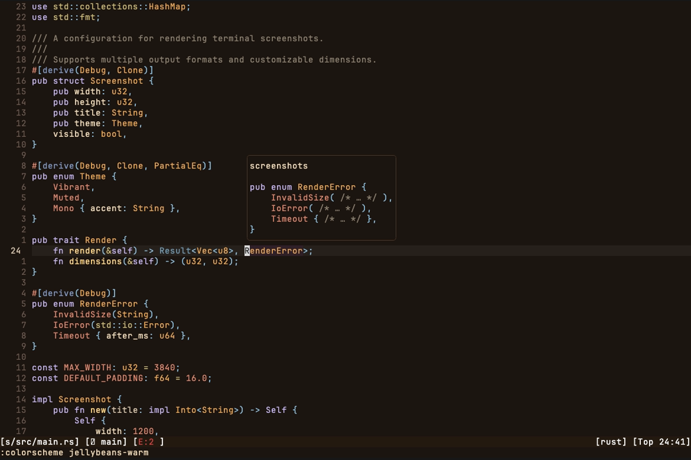
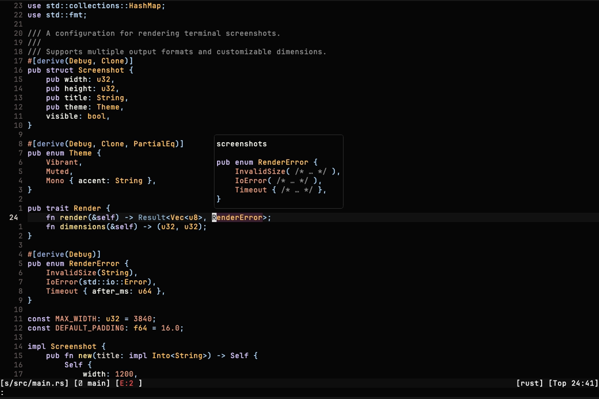

# Jellybeans.nvim

A Neovim port of the classic [jellybeans](https://github.com/nanotech/jellybeans.vim) colorscheme — multiple palettes, full Treesitter and LSP support, and [extras for popular terminal apps](https://github.com/WTFox/jellybeans.nvim/tree/main/extras).



## Installation

Using [lazy.nvim](https://github.com/folke/lazy.nvim):

```lua
{
  "wtfox/jellybeans.nvim",
  lazy = false,
  priority = 1000,
  opts = {},
}
```

```lua
vim.cmd[[colorscheme jellybeans]] -- vibrant dark (default)
```

## Palettes

<details>
<summary>Palette Gallery</summary>

<table>
  <tr>
    <th>Vibrant Dark (<code>jellybeans</code>)</th>
    <th>Vibrant Light (<code>jellybeans-light</code>)</th>
    <th>Muted Dark (<code>jellybeans-muted</code>)</th>
    <th>Muted Light (<code>jellybeans-muted-light</code>)</th>
  </tr>
  <tr>
    <td></td>
    <td></td>
    <td></td>
    <td></td>
  </tr>
  <tr>
    <th>Mono Dark (<code>jellybeans-mono</code>)</th>
    <th>Mono Light (<code>jellybeans-mono-light</code>)</th>
    <th>Warm (<code>jellybeans-warm</code>)</th>
    <th>High Contrast (<code>jellybeans-hc</code>)</th>
  </tr>
  <tr>
    <td></td>
    <td></td>
    <td></td>
    <td></td>
  </tr>
</table>

</details>

| Palette | Colorscheme(s) | Description |
|---|---|---|
| Vibrant | `jellybeans` / `jellybeans-light` | Classic rich, saturated colors |
| Muted | `jellybeans-muted` / `jellybeans-muted-light` | Lower saturation, paper-like feel |
| Mono | `jellybeans-mono` / `jellybeans-mono-light` | Monochrome with two configurable accent colors |
| Warm | `jellybeans-warm` | Neutral tones shifted toward amber and espresso |
| High Contrast | `jellybeans-hc` | Near-black background with boosted accent saturation |

## Configuration

```lua
{
  transparent = false,
  italics = true,
  bold = true,
  flat_ui = true, -- toggles "flat UI" for pickers
  background = {
    dark = "jellybeans",       -- default dark palette
    light = "jellybeans_light", -- default light palette
  },
  plugins = {
    all = false,
    auto = true, -- auto-detect installed plugins via lazy.nvim
  },
  on_highlights = function(highlights, colors) end,
  on_colors = function(colors) end,
}
```

### Customizing colors

Override any palette color via `on_colors`. Example — pure black background for OLED:

```lua
opts = {
  on_colors = function(c)
    c.background = vim.o.background == "light" and "#ffffff" or "#000000"
  end,
}
```

The mono palette exposes two accent colors:

```lua
opts = {
  on_colors = function(c)
    c.accent_color_1 = "#876543" -- types and constants
    c.accent_color_2 = "#345678" -- functions
  end,
}
```

### Customizing highlights

```lua
opts = {
  on_highlights = function(hl, c)
    hl.Constant = { fg = "#00ff00", bold = true }
  end,
}
```

### Lualine

```lua
require('lualine').setup {
  options = { theme = 'jellybeans-nvim' }
}
```

## Extras

Terminal and app themes for FZF, Ghostty, Kitty, Tmux, Wezterm, Windows Terminal, Yazi, and more — see the [extras directory](https://github.com/WTFox/jellybeans.nvim/tree/main/extras).

## Inspirations

- [jellybeans.vim](https://github.com/nanotech/jellybeans.vim)
- [tokyonight.nvim](https://github.com/folke/tokyonight.nvim) by [Folke](https://github.com/folke)
- [jellybeans-nvim](https://github.com/metalelf0/jellybeans-nvim) by [metalelf0](https://github.com/metalelf0)
- [jbeans](https://github.com/scajanus/jbeans) by [scajanus](https://github.com/scajanus)

## Star History

<a href="https://star-history.com/#wtfox/jellybeans.nvim&Date">
 <picture>
   <source media="(prefers-color-scheme: dark)" srcset="https://api.star-history.com/svg?repos=wtfox/jellybeans.nvim&type=Date&theme=dark" />
   <source media="(prefers-color-scheme: light)" srcset="https://api.star-history.com/svg?repos=wtfox/jellybeans.nvim&type=Date" />
   
 </picture>
</a>
